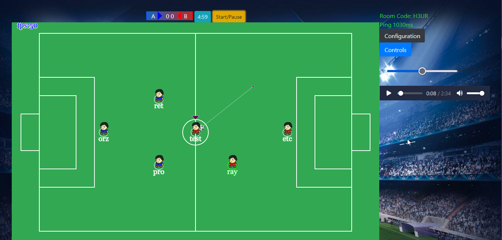
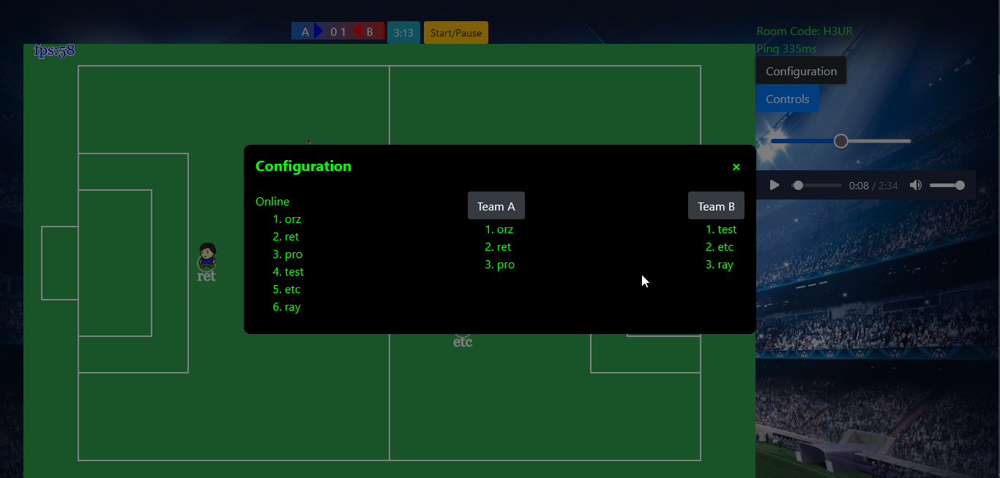

#   <a href="http://real-soccer.herokuapp.com/">Real Soccer</a>
---

## Live Hosted on https://real-soccer.herokuapp.com/
  

### Features
---
1. Real Time playing in separate rooms (Implemented by using socket.io)
1. Simple Player Controls (Implemented in vanilla JavaScript)
1. Authoritative Server (Implemented in Nodejs)

### ScreenShots
1. players just joined

2. game started (players in set positions, teams assigned)

3. team/player status

### Frameworks and Languages
---

        
 

### Instructions for playing
---
1. Create or Join Room (Either in some open room by clicking its name in Online Rooms tab or by entering room code in input box)
1. Click the Start/Pause Button
1. Control player movement with w,a,s,d
1. Grab the ball by going close to it
1. Point the shooting direction with mouse pointer
1. Kick the ball with Left Click
1. Refresh the page to go back to home screen

### Instructions for local testing
---
1. `git clone https://github.com/bhuvan-byte/street-soccer-multi.git`
1. `cd .\street-soccer-multi`
1. `npm install`
1. `npm run dev`
1. `It will be running on localhost:8000`

### Upcoming Features
---
1. Live Voice/text Chatting in the room
1. Customisable players
1. Bot players

### Contact Developers
---
[ Bhuvan](https://www.linkedin.com/in/bhuvan1)
[ Raahil](https://www.linkedin.com/in/raahilbadiani)
